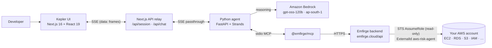

# Kepler — Architecture

## Flow

## Components
- **Kepler UI** (`src/components/workspace/agent-workspace.tsx`): two panels. Left = live, zoned trace of the agent working with the cloud (tool calls, findings, attack path, crown jewels, compliance, before→after). Right = chat with the Kepler agent + decision buttons (Approve / Keep as-is / Review diff). All rendered from a live event stream; nothing hard-coded.
- **Next.js relay** (`src/app/api/{session,chat}/route.ts`): thin one-origin proxy to the Python agent; passes SSE frames through verbatim. Upstream set by `AGENT_SERVICE_URL` (default `http://localhost:8787`).
- **Python agent** (`agent/`): FastAPI service. `agent_core.py` builds a Strands `Agent` on Amazon Bedrock (`streaming=False` — the bearer-token path rejects ConverseStream), streams activity/tool events via `agent.stream_async`, and after the turn extracts the final reply + tool results from `agent.messages`. Tool results are turned into typed SSE events.
- **Emfirge MCP** (`npx -y @emfirge/mcp`, launched as a stdio subprocess): 15 tools (scan, attack_paths, check_compliance, create_branch, apply_change, branch_diff, branch_verdict, …) that call the hosted Emfirge backend, which does the read-only STS AssumeRole into the user's account.

## Event contract (SSE `data: {type,data,ts}`)
`status` (connected/scanned/done), `activity` (tool calls), `token` (agent reply), `finding`, `attackpaths`, `compliance`, `diff`, `beforeafter`, `decision`, `error`. Shared types + parser in `src/lib/agent-events.ts`.

## Read-only guarantee
The assumed role has no write permissions; the agent never calls a mutating AWS API; every branch/apply happens inside Emfirge's in-memory fork. The UI always shows **0 cloud writes**.

## Demo/replay mode
`KEPLER_DEMO=1` replays a captured real run (`agent/demo_fixture.json`) through the same emission code, so the exact same events reach the UI with no network/AWS/quota dependency.
