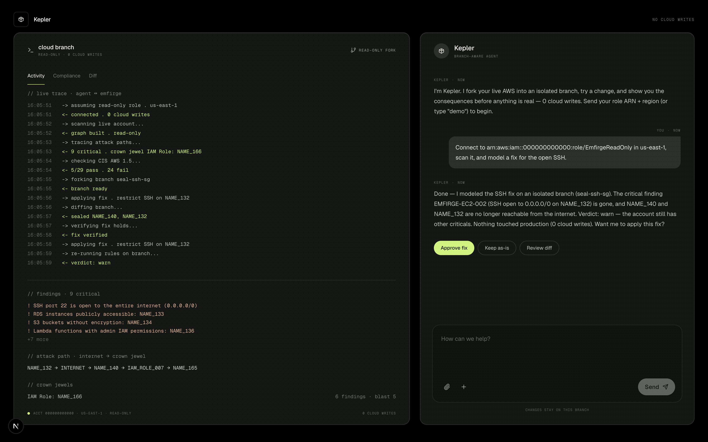

<div align="center">

# 🪐 Kepler

### Branch your cloud. Try the change. See the future before it's real.

Kepler is an autonomous, **read-only** AWS agent that forks your live infrastructure, models a fix on an isolated branch, and proves it closes the attack path — **before anything touches production**.



</div>

---

## The 30-second version

Your AWS account changes constantly. CloudTrail tells you *what* changed — never whether it's **dangerous**, or what a fix would actually *do*. So risky changes get tested in prod, or lost in alert noise.

Kepler connects **read-only** and, for a risky change:

1. **Scans** your live infra and traces the real **attack path** — `internet → security group → EC2 → IAM role → database`.
2. **Forks** the graph into an isolated branch and **applies the fix** there.
3. Shows the **before → after** — which critical findings vanish, what's no longer internet-reachable, the new verdict.
4. Asks **you** one question — *Approve / Keep / Review* — and records it.

**0 cloud writes. Ever.** The agent does the judgment; the human makes the call.

> Emfirge is the harness between AI and your cloud. **Kepler is the agent that puts your real cloud in front of an AI — safely.**

## Watch it think

The left panel streams the agent working with your cloud, live — every tool call and result:
```
-> scanning live account...
<- 9 critical . crown jewel IAM Role: NAME\_166
-> forking branch seal-ssh-sg
-> applying fix . restrict SSH on NAME\_132
<- sealed NAME\_140, NAME\_132
<- verdict: warn
```

## How AWS powers it

- **Amazon Bedrock** (`openai.gpt-oss-120b`) — the agent's reasoning, via the **Strands Agents SDK**.
- **AWS STS AssumeRole** — read-only access to your account. No write permissions, ever.
- Reads EC2/SG, RDS, S3, IAM, Lambda, ECS, VPC, CloudTrail… Free-tier friendly; demo mode makes **zero** AWS calls.

Full diagram in [ARCHITECTURE.md](ARCHITECTURE.md).

## Try it in 30 seconds (no AWS needed)
```bash
npm install
cd agent && python -m venv .venv && .venv/bin/pip install -r requirements.txt && cd ..
KEPLER_DEMO=1 agent/.venv/bin/uvicorn agent.main:app --port 8787   # terminal 1
npm run dev                                                        # terminal 2
```

Open [http://localhost:3000](http://localhost:3000), type **`demo`**, and watch a full real run replay. For a live scan, drop `KEPLER_DEMO=1` and send your read-only role ARN + region.

## Built with

Strands Agents SDK · Amazon Bedrock · AWS STS · [@emfirge/mcp](https://www.npmjs.com/package/@emfirge/mcp) · Next.js 16 · React 19 · FastAPI · Tailwind

## Credits & disclosure

Kepler consumes **Emfirge** — a pre-existing cloud-branching engine by the same author ([github.com/theanshsonkar/emfirge](https://github.com/theanshsonkar/emfirge)) — via its public `@emfirge/mcp` package, which provides the graph, branch simulation, findings, attack paths and verdict. The work built for this hackathon is **Kepler**: the autonomous agent loop, the Bedrock + Strands integration, the streaming event pipeline, the workspace UI, and the human decision flow. Built with AI coding tools (Kiro).

Built for the WeMakeDevs × AWS "First Commit" hackathon (Sept 2026). Licensed MIT — see [LICENSE](LICENSE).
